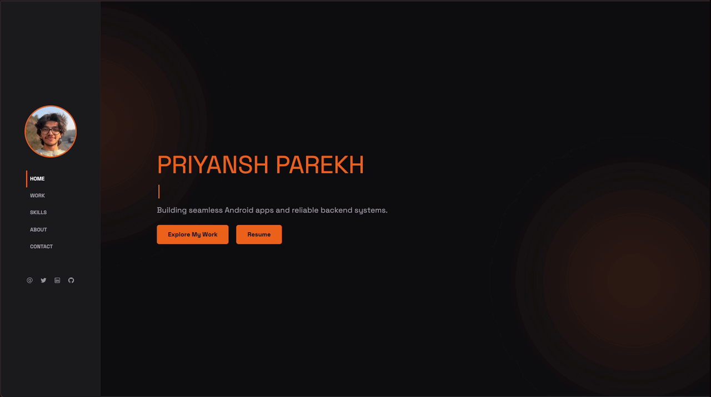

# Priyansh Parekh — Portfolio

Personal portfolio site for Priyansh Parekh, Software Developer specializing in Android apps and backend systems.

**Live site:** [pparekh2009.github.io](https://pparekh2009.github.io)



## About

A single-page portfolio (with dedicated pages for the full project list and individual project details) showcasing full-stack and Android projects, technical skills, education/experience, and a way to get in touch.

## Features

- **Home** — animated intro with a typing effect
- **Work** — featured projects with hover-reveal descriptions, linking out to full case studies
- **Skills** — technologies grouped by category (Mobile, Backend, ML/Data, DevOps/Cloud)
- **About** — education and experience timeline
- **Contact** — direct contact form with live success/error feedback
- **All Projects** — full project archive grouped by category
- **Project Details** — per-project breakdown with features, tech stack, screenshots carousel, and links

## Tech Stack

- HTML5, CSS3, vanilla JavaScript
- [Bootstrap 5](https://getbootstrap.com/) for layout and components
- [AOS](https://michalsnik.github.io/aos/) for scroll animations
- [Line Awesome](https://icons8.com/line-awesome) for icons
- [Space Grotesk](https://fonts.google.com/specimen/Space+Grotesk) (Google Fonts)
- Hosted on GitHub Pages

## Project Structure

```
├── index.html               # Home page (hero, work, skills, about, contact)
├── all_projects.html        # Full project archive
├── project_details.html     # Individual project detail page
├── assets/
│   ├── css/                 # Stylesheets
│   ├── js/                  # Page scripts
│   ├── json/                # Project & tech-stack data
│   └── images/               # Images and icons
```

## Connect

- Email: [parekhpriyansh20@gmail.com](mailto:parekhpriyansh20@gmail.com)
- LinkedIn: [linkedin.com/in/priyansh-parekh](https://www.linkedin.com/in/priyansh-parekh/)
- GitHub: [@pparekh2009](https://github.com/pparekh2009)
